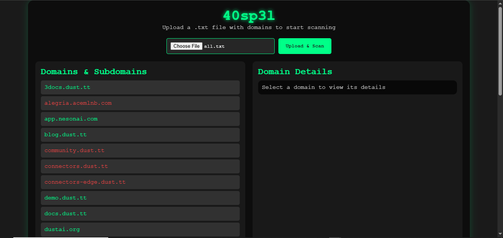

# 4oSP3L
4osp3l is a web platform for bug bounty hunters that allows users to upload a .txt file with domains and subdomains. Selecting a domain displays its HTTP status code, headers, Content-Length, redirection URL (if any), and the webfront's HTML source code.

# INSTALL MODULE 
- npm install express multer axios

# START 40sp3l
- npm start 

